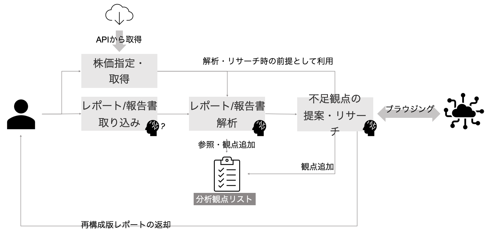

# LTS_Tokyo_Hackathon_2024
LTS Group Tokyo Hackathon 2024 Team B

https://docs.google.com/spreadsheets/d/1-AdqhQyj-uv4mbVIf-VABBC92BVB6Hv4/edit#gid=1352152124
## Theme

**株価データを使用した、株価向上のための考察・提案**

- 競合を含む数社の株価トレンドデータ（2016~2020の5年分週足）を使用
- 証券アナリストのように株価の変動要因について説明を生成する。
- 株価トレンドの特徴的な変化について、関連する市場情報（公開情報やニュース）を参照し、変動の理由を述べる。
- 追加で有価証券報告書等の開示データを与えた場合における株価向上に向けた提案の生成を行う。

## Product Concept

**人の視野を広げる**

## Problems

- 弊社で着目するのは市場シェア（結果）が変動した時に何が起きていたのかを探るのですが、マーケティング４P以外で説明できない部分（流行　インフルエンサ　メディア）の影響が大きいと感じています。
- 説明できない部分は人が補う形で分析を進めていますが、こちらも分析者（人）に依存するところに限界があります。
- 人は自分の知っている範囲でしか解釈ができません。機械であれば人が見落としてしまうようなことを発見し気づきを提供できると思っています。
- 繰り返しになりますが、弊社が今何をやっているかに関係なく、上記の目的（課題解決：人の能力の壁を超える気づきを提供する）のために必要な枠組みとツールを自由に考えていただければよいと思います。

## Aproach

- 作成されたトレンド分析を解析することで「そこにどのような観点が含まれており、逆にどんな観点が欠けているのか」「欠けている観点に注目するとどのような情報が存在するのか」を気づかせるアプリケーションを目指します
- 人とアプリケーションが対話的にレポートの作成・改善を繰り返すことで、ナレッジとして分析観点がアプリケーション内に蓄積され、さらに多角的な観点からの分析が可能になる「育成する」アプリケーションです

## Architecture



## MVP

- 取得対象株価入力機能
- レポート投入機能
- 株価取得機能
- レポートからのテキスト抽出機能
- レポートに対するOCR機能
- レポート要約機能
- レポートからの観点抽出機能
- 観点追加機能
- 観点リストダウンロード/アップロード機能
- 検索用プロンプト作成機能
- 株価推移の理由検索機能
- 検索結果からの観点抽出機能
- 株価推移に対する理由考察レポートの作成
- 結果文章表示機能
- 追加観点表示機能

## Run

```bash
npm run dev
```

## Build

```bash
npm run build
```

## Test

```bash
npm run 
```

## Deploy

GitHub ActionsによるCDでデプロイ
